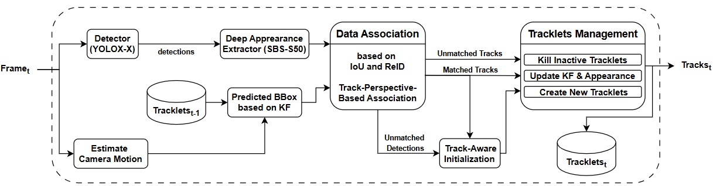
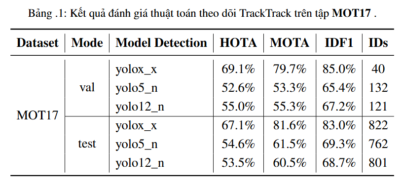

# CS420 - Pedestrian Tracking in Videos (Streamlit)
Dự án này triển khai một ứng dụng Streamlit app để theo dõi các đối tượng (người đi bộ) trong chuỗi các khung hình (video) bằng cách sử dụng phương pháp Tracking-by-Detection. Ứng dụng này sử dụng mô hình YOLOX để phát hiện người đi bộ và FastReID để trích xuất đặc trưng nhận dạng, kết hợp với thuật toán theo dõi TrackTrack để duy trì nhận dạng người qua các khung hình.



## 📦 Công nghệ và Thư viện sử dụng

- [YOLOX](https://github.com/Megvii-BaseDetection/YOLOX): Phát hiện đối tượng.
- [TrackTrack](https://github.com/kamkyu94/TrackTrack): Thuật toán theo dõi đối tượng trong bài toán Mutil Object Tracking (MOT).
- [FastReID](https://github.com/JDAI-CV/fast-reid): Trích xuất đặc trưng nhận dạng đối tượng (SBS-S50).
- [Streamlit](https://streamlit.io/): Giao diện Web tương tác.
- GPU: NVIDIA GeForce RTX 3050 Laptop GPU.

## 📂 Cấu trúc thư mục
```bash
Pedestrian_Tracking
├── .streamlit/
├── Appplication/
    ├── demo_Tracktrack.py
    └── app.py
├── assets/
├── Input/
├── Outputs/
├── Tracktrack/
    ├── YOLOX/
    ├── FastReID/
    └── Tracker/
├── Utils/
├── .gitignore
├── env.ini
├── requirements.txt
└── README.md

```
## 🚀 Cài đặt và sử dụng
Để chạy dự án, hãy làm theo các bước sau:

### 1. Clone Repository

```bash
git clone https://github.com/HuynhNghiaKHMT/Pedestrian_Tracking.git
cd Pedestrian_Tracking
```

### 2. Tạo môi trường ảo
```bash
python -m venv venv
venv\Scripts\activate  # Trên Windows
```

### 3. Cài đặt các thư viện cần thiết
```bash
pip install -r requirements.txt
```

### 4. Các mô hình trọng số
Tải các mô hình trọng số đã được huấn luyện sẵn và đặt chúng vào đúng thư mục "./weights/":
- YOLOX_X:[mot17.pth.tar](https://drive.google.com/file/d/1MAb-Bhikx-fWe0VlJON_VMrYIyyyrt-F/view?usp=drive_link)
- FastReID (SBS-S50): [mot17_sbs_S50.pth](https://drive.google.com/file/d/1rUYqWIj0nsQ23rDSv8NVx0Rrp3Lco1KP/view?usp=drive_link)
- AFLinker: [mot17.pth.tar](https://drive.google.com/file/d/1rUYqWIj0nsQ23rDSv8NVx0Rrp3Lco1KP/view?usp=drive_link)
```bash
pip install -r requirements.txt
```

## 📝 Đánh giá mô hình theo dõi qua các bộ phát hiện khác nhau



**Lưu ý**: 
- Kết quả của YOLOX cao hơn so với YOLOv5 và YOLOv12 do mô hình YOLOX được huấn luyện chuyên biệt cho bài toán phát hiện người đi bộ, trong khi YOLOv5 và YOLOv12 là các mô hình tổng quát hơn và chúng tôi chỉ sử dụng để so sánh hiệu quả và không hề huấn luyện lại.
- Kết quả test được nộp theo chuẩn của MOT Challenge trên Codabench: https://www.codabench.org/competitions/10049/

## 🏃 Demo
### 1. Chạy Demo ByteTrack cơ bản
Sau khi cài đặt các thư viện trong requirements.txt:
```bash
python Application/demo_Tracktrack.py
```
Lệnh này sẽ chạy demo tracking trực tiếp trên máy tính của bạn với video mẫu được cung cấp trong thư mục Input và các video kết quả trong thư mục Outputs.

### 2. Chạy Demo với ứng dụng Streamlit
```bash
python -m streamlit run Application/app.py
```
Lệnh này sẽ chạy demo tracking trực tiếp trên Streamlit app và hỗ trợ điều chỉnh các tham số khác nhau. Mở trình duyệt và truy cập vào địa chỉ http://localhost:8501 để sử dụng ứng dụng.

## 🎞️ Video Demo
Dưới đây là một đoạn video/GIF ngắn minh họa hoạt động của ứng dụng Tracking-by-Detection mà chúng mình đã triển khai:

<!--  -->
https://github.com/user-attachments/assets/a498fc7f-1f76-4edc-b212-cb2d0e9c3cf5


## 📬 Thông tin thành viên nhóm
| Họ và Tên         | MSSV     | Email                 |GitHub                                      |
|-------------------|----------|------------------------|--------------------------------------------|
| Huỳnh Trung Nghĩa | 22520945 | 22520945@gm.uit.edu.vn | [HuynhNghiaKHMT](https://github.com/HuynhNghiaKHMT) |
| Huỳnh Chí Nhân | 22520996 | 22520996@gm.uit.edu.vn | [nhanhuynh123](https://github.com/nhanhuynh123) |
| Nguyễn Hồng Phát | 22521076 | 22521076@gm.uit.edu.vn | [hongphat13](https://github.com/hongphat13) |

## 💖 Lời cảm ơn

Chúng mình xin gửi lời cảm ơn chân thành đến cộng đồng mã nguồn mở và các tác giả đã phát triển những thư viện tuyệt vời như YOLO, Fast Reid, TrackTrack. Nhờ những công cụ đó mà bọn mình có thể học hỏi, thử nghiệm và hoàn thành đồ án này.
